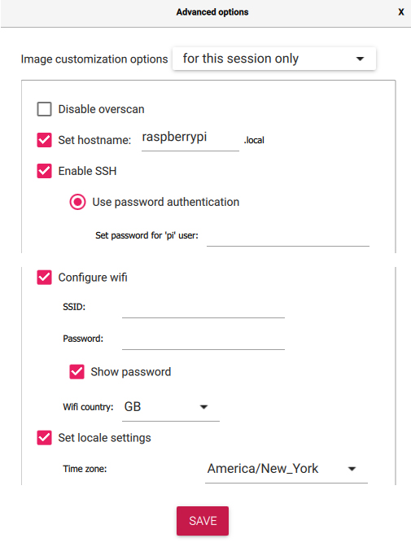
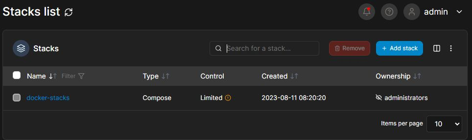
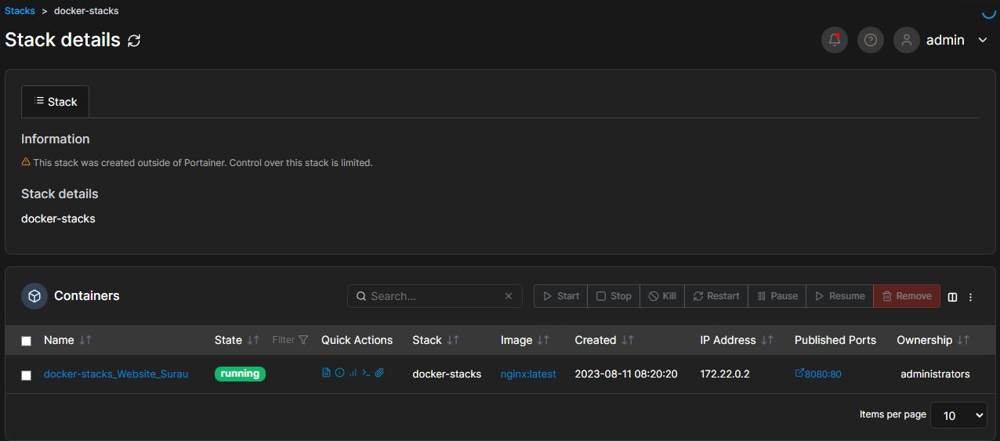
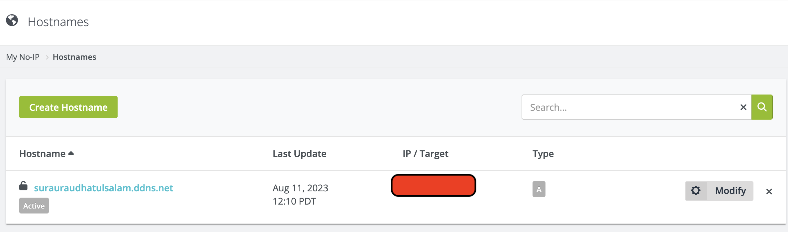
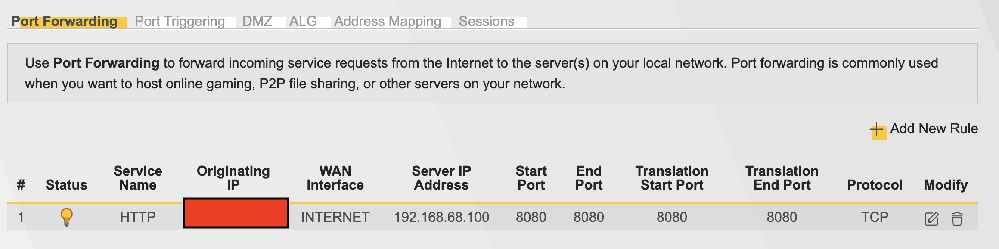

# homelab-DockerProject
*Docker running on raspberry pi 4

Disclaimer: This project started on August 2023, some package might different 

## 1) Install linux on Raspberry pi 4
Please download Raspberry Pi OS (64-bit) since it have 8GB of RAM
Please download [Raspberry Pi OS (64-bit)](https://www.raspberrypi.com/software/operating-systems/) since it have 8GB of RAM

Use imager from raspberry pi, click advance setting to enable ssh and using port 22.
Also please set appropriate hostname


## 2) ssh into raspberry pi
## 3) Install docker
### a) Install the necessary packages to allow apt to use a repository over HTTPS:
```sudo apt update
sudo apt install apt-transport-https ca-certificates curl gnupg-agent software-properties-common
```

### b) Add the Docker GPG key to ensure the authenticity of the Docker packages
```
curl -fsSL https://download.docker.com/linux/raspbian/gpg | sudo gpg --dearmor -o /usr/share/keyrings/docker-archive-keyring.gpg

```

### c) Add the Docker repository to the system's package sources:
```
echo "deb [arch=amd64 signed-by=/usr/share/keyrings/docker-archive-keyring.gpg] https://download.docker.com/linux/debian $(lsb_release -cs) stable" | sudo tee /etc/apt/sources.list.d/docker.list > /dev/null
```

### d) Update the package index again to include the Docker packages from the newly added repository:
```sudo apt update
```

### e) Install docker
```
sudo apt install docker-ce docker-ce-cli containerd.io
```

### f) Docker should now be installed on your Debian system. You can verify it by checking the Docker version:
```
docker --version
```

If Docker is installed correctly, it will display the installed version.

### g) Additional
```
sudo usermod -aG docker $USER
```


## Install Portainer (To undersand more how docker vs docker-compose works)
### 1) Pull the Portainer image from Docker Hub by running the following command:
```
sudo docker pull portainer/portainer-ce:linux-arm
```
### 2) Once the image is downloaded, create a Docker container with the following command:
```
sudo docker run -d -p 9000:9000 --restart always -v /var/run/docker.sock:/var/run/docker.sock --name portainer portainer/portainer-ce:linux-arm
```
## 3) To confirm portainer are running
```
sudo docker ps
```

Docker Stacks @ Docker compose

Install ```docker-compose```
download the Docker Compose binary:
```
sudo curl -L "https://github.com/docker/compose/releases/latest/download/docker-compose-$(uname -s)-$(uname -m)" -o /usr/local/bin/docker-compose
```
 Once the download is complete, set the correct permissions for the Docker Compose binary:
 ```
sudo chmod +x /usr/local/bin/docker-compose
```

```
pi@pi-nas:~/DockerCompose $ docker-compose --version
Docker Compose version v2.20.3
```
Create file docker ``` vim docker-compose.yml ```

```
version: '3'
services:
  website:
    image: nginx:latest
    ports:
      - 8080:80
    volumes:
      - ./website:/usr/share/nginx/html
    container_name: docker-stacks_Website_Surau
    restart: always

```






This command starts the containers in the background and allows you to continue using the terminal without interrupting Docker Compose.

Bring up the docker stacks
```
docker-compose up -d
```

To transfer file from RP4 to docker (ed02ab0840bb)
```
docker cp /home/pi/html-files/. ed02ab0840bb:/usr/share/nginx/html/
```

To enter docker
```
docker exec -it ed02ab0840bb bash
```

Result running NGINX in docker compose (example of website)


### 1) Register No-IP DDNS

### 2) Enable port fowarding from router



## Open port *If needed

#### 1) Update repo
```
sudo apt update
```

#### 2) Download firewall
```
sudo apt install ufw
```

#### 3) Enable firewall on startrp
```
sudo ufw enable
```

#### 4) Open selected port
```
sudo ufw allow 9001
```

#### 5) Check port open
```
sudo ufw status numbered
```
or 
```
sudo netstat -tuln
```
